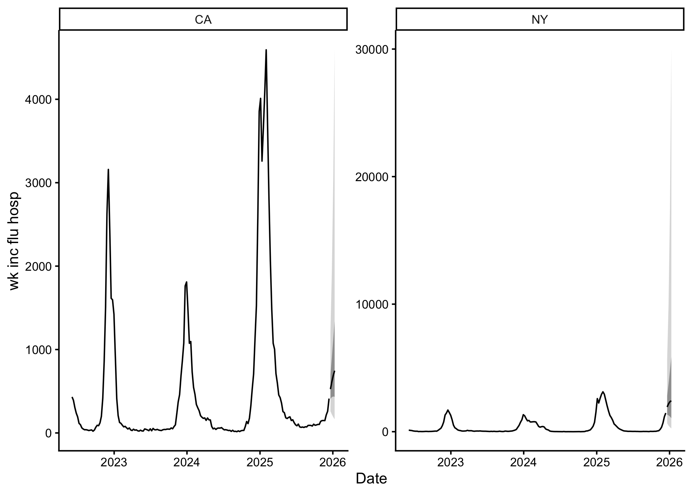

<!-- README.md is generated from README.Rmd. Please edit that file -->

# insight.cast <a href="https://accidda.github.io/insight.cast/"></a>

<!-- badges: start -->
[](https://github.com/ACCIDDA/insight.cast/actions/workflows/R-CMD-check.yaml)
[](https://app.codecov.io/gh/ACCIDDA/insight.cast)
<!-- badges: end -->

`insight.cast` is an R package for infectious disease nowcasting and
forecasting. It was developed through **[Insight
Net](https://www.cdc.gov/insight-net)**, a **[CDC Center for Forecasting
and Outbreak
Analytics](https://www.cdc.gov/forecast-outbreak-analytics/index.html)**
initiative.

Use it to fetch or validate data, correct reporting delays, compare
models and produce forecasts.

## Installation

Install the development version from GitHub:

``` r
# install.packages("pak")
pak::pak("ACCIDDA/insight.cast")
```

## Quick start

``` r
library(insight.cast)
tail(example_data)
#> # A tibble: 6 × 5
#>   as_of      location target          target_end_date observation
#>   <date>     <chr>    <chr>           <date>                <dbl>
#> 1 2025-12-07 CA       wk inc flu hosp 2025-12-06              233
#> 2 2025-12-14 CA       wk inc flu hosp 2025-12-06              259
#> 3 2025-12-07 NY       wk inc flu hosp 2025-12-06             1160
#> 4 2025-12-14 NY       wk inc flu hosp 2025-12-06             1171
#> 5 2025-12-14 CA       wk inc flu hosp 2025-12-13              412
#> 6 2025-12-14 NY       wk inc flu hosp 2025-12-13             1462
```

``` r
fcast <- example_data |>
  check_data() |>
  get_ncast() |>
  get_cv(eval_start_date = as.Date("2024-10-01")) |>
  get_fcast()
```

``` r
fcast
#> <insight.cast_fcast>
#> Target:   wk inc flu hosp
#> Series:   2 (location)
#> Forecast: 2025-12-20 to 2026-01-10 (h = 4)
#> Models:   4 + ENSEMBLE

fcast |> autoplot()
```



Save a forecast for
[myRespiLens](https://www.respilens.com/myrespilens):

``` r
library(dplyr)
fcast$hub$model_out_tbl |>
  dplyr::mutate(
    location = dplyr::recode(
      location,
      CA = "06",
      NY = "36"
    )
  ) |>
  write.csv("myrespilens_forecast.csv", row.names = FALSE)
```

## Citation

To cite `insight.cast`:

``` r
citation("insight.cast")
#> To cite package 'insight.cast' in publications use:
#> 
#>   Geismar C (2026). _insight.cast: Tools for Epidemic Forecasting_. R package
#>   version 0.0.1, <https://github.com/ACCIDDA/insight.cast>.
#> 
#> A BibTeX entry for LaTeX users is
#> 
#>   @Manual{,
#>     title = {insight.cast: Tools for Epidemic Forecasting},
#>     author = {Cyril Geismar},
#>     year = {2026},
#>     note = {R package version 0.0.1},
#>     url = {https://github.com/ACCIDDA/insight.cast},
#>   }
```

## Acknowledgements

`insight.cast` uses
[`baselinenowcast`](https://baselinenowcast.epinowcast.org/) and
[`fable`](https://fable.tidyverts.org/). It returns forecasts in
[`hubverse`](https://hubverse.io/) format for submission to [CDC
forecast
hubs](https://www.cdc.gov/cfa-modeling-and-forecasting/about/index.html).
