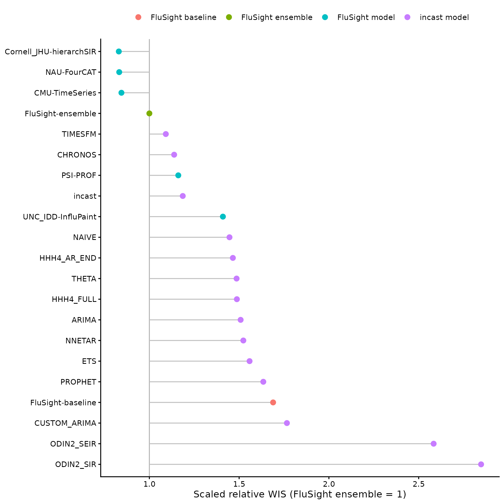
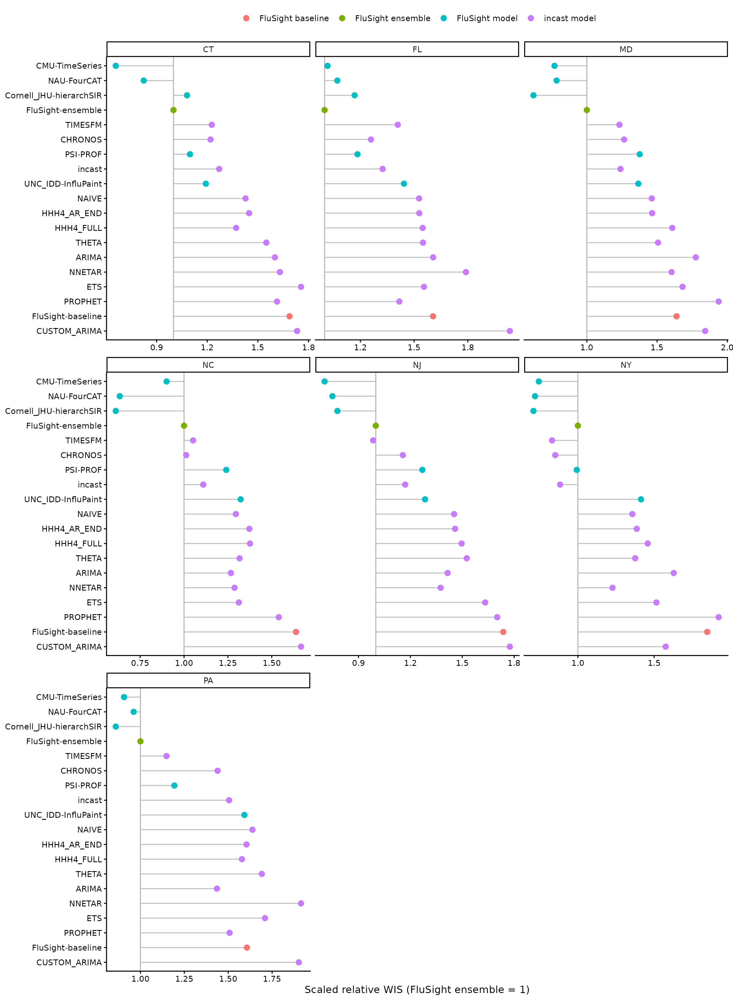

# Evaluating incast against FluSight

## Overview

This vignette replays the 2025–26 US [FluSight
season](https://github.com/cdcepi/FluSight-forecast-hub/tree/v1.2.0) as
if `incast` had submitted each week.

The evaluation covers:

- 7 states: Connecticut, Florida, Maryland, New Jersey, New York, North
  Carolina, and Pennsylvania;
- 27 forecast rounds from November 22, 2025, through May 23, 2026; and
- weekly incident influenza hospital admissions at horizons 0–3.

Model fitting is not run when the vignette is built. Packaged forecasts
and scores keep the plots fast and reproducible.

## Use the saved forecasts

The backtest is available as `flusight_forecasts`:

``` r

flusight_forecasts |>
  select(model_id, reference_date, horizon, location, output_type_id, value) |>
  head()
#> # A tibble: 6 × 6
#>   model_id reference_date horizon location output_type_id value
#>   <chr>    <date>           <int> <chr>    <chr>          <int>
#> 1 NAIVE    2025-11-22           0 09       0.025              3
#> 2 NAIVE    2025-11-22           0 09       0.25               7
#> 3 NAIVE    2025-11-22           0 09       0.5               11
#> 4 NAIVE    2025-11-22           0 09       0.75              17
#> 5 NAIVE    2025-11-22           0 09       0.975             37
#> 6 NAIVE    2025-11-22           1 09       0.025              1
```

Save a Hubverse-format CSV for [myRespiLens](https://myrespilens.com):

``` r

write.csv(flusight_forecasts, "incast.csv", row.names = FALSE)
```

The data contain every candidate that fitted successfully. For each
state and round, the three candidates with the lowest cross-validation
weighted interval score (WIS) are combined with equal weights and stored
as `model_id = "incast"`.

## Backtest design

### Reconstruct the data available at each deadline

A FluSight round is indexed by a Saturday `reference_date`, but its
submission deadline was the preceding Wednesday. Horizon 0 predicts the
week ending on the reference date; horizons 1–3 predict the following
three weeks.

For a round with reference date $`d`$, the backtest uses only
surveillance records with `as_of <= d - 6 days`. For example, the
November 22, 2025, round uses data released by November 16. This
reproduces the revision state available before the November 19
submission deadline and prevents future revisions from leaking into
model selection. No reporting-delay adjustment is applied.

This unevaluated code retrieves the revision history:

``` r

states <- c("CT", "FL", "MD", "NJ", "NY", "NC", "PA")

revision_history <- get_data(
  pathogen = "flu",
  geo_value = tolower(states),
  revisions = TRUE
)$data
```

### Select a model independently for each state and round

For each round:

1.  Use dates 52, 104, and 156 weeks before the current reference date
    to represent the same period in the three previous seasons.
2.  Use that week and the next two weeks as nine cross-validation
    origins.
3.  At each origin, fit every candidate using only earlier observations
    and score its four-week forecast against the latest values available
    for that round.
4.  Select the three lowest-WIS candidates separately for each state.
5.  Refit every candidate to the current data and combine the selected
    three using an equal-weight linear pool. Save this ensemble as
    `incast`.

The candidates include the four defaults, plus ARIMA, HHH4, Prophet,
neural network, mechanistic and foundation models:

``` r

library(fable)
library(fable.prophet)
library(igraph)
library(incast.odin)
library(reticulate)
library(surveillance)

locations <- read.csv(
  paste0(
    "https://raw.githubusercontent.com/cdcepi/FluSight-forecast-hub/",
    "v1.2.0/auxiliary-data/locations.csv"
  )
) |>
  as_tibble() |>
  filter(abbreviation %in% states)

population <- locations |>
  mutate(population = population / sum(population)) |>
  pull(population, name = abbreviation)

neighbourhood <- graph_from_data_frame(
  rbind(
    c("CT", "NY"),
    c("MD", "PA"),
    c("NJ", "NY"),
    c("NJ", "PA"),
    c("NY", "PA")
  ),
  directed = FALSE,
  vertices = locations$abbreviation
) |>
  as_adjacency_matrix(sparse = FALSE)

annual_seasonality <- addSeason2formula(
  f = ~1,
  S = 1,
  period = round(365.25 / 7)
)

my_models <- c(
  default_models(),
  list(
    CUSTOM_ARIMA = ARIMA(observation ~ pdq(1, 1, 0)),
    ODIN2_SIR = odin_sir(observation),
    ODIN2_SEIR = odin_seir(observation),
    HHH4_AR_END = HHH4(
      observation,
      control = list(
        ar = list(f = ~1, lag = 1),
        ne = list(f = ~ -1),
        end = list(f = annual_seasonality),
        family = "NegBin1"
      ),
      population = population
    ),
    HHH4_FULL = HHH4(
      observation,
      control = list(
        ar = list(f = ~1, lag = 1),
        ne = list(f = ~1, lag = 1, normalize = FALSE),
        end = list(f = annual_seasonality),
        family = "NegBin1"
      ),
      neighbourhood = neighbourhood,
      population = population
    ),
    PROPHET = prophet(observation ~ season("year")),
    NNETAR = NNETAR(observation),
    CHRONOS = FOUNDATION(log1p(observation), "chronos"),
    TIMESFM = FOUNDATION(log1p(observation), "timesfm")
  )
)
```

The round-level implementation makes the data cutoff and seasonal
cross-validation explicit:

``` r

cv_seasons <- 2022:2024
reference_dates <- seq.Date(
  from = as.Date("2025-11-22"),
  to = as.Date("2026-05-23"),
  by = "1 week"
)

fcast_round <- function(ref_date) {
  ref_date <- as.Date(ref_date)

  round_data <- revision_history |>
    filter(as_of <= ref_date - 6L) |>
    check_data()

  last_observed_date <- round_data$window[["to"]]
  last_target_date <- ref_date + 3L * 7L
  stopifnot(last_observed_date < ref_date)

  # Forecast far enough to return horizons 0--3 even when reporting lags.
  forecast_steps <- as.integer(
    last_target_date - last_observed_date
  ) %/%
    7L

  aligned_weeks <- seq.Date(
    from = ref_date,
    by = "-52 weeks",
    length.out = length(cv_seasons) + 1L
  )[-1L]

  cv_origins <- sort(c(
    aligned_weeks,
    aligned_weeks + 7L,
    aligned_weeks + 14L
  ))

  cv <- get_cv(
    round_data,
    h = 4,
    origins = cv_origins,
    models = my_models
  )

  get_fcast(cv, h = forecast_steps, top_n = 3)$hub$model_out_tbl |>
    transmute(
      model_id = if_else(model_id == "ENSEMBLE", "incast", model_id),
      reference_date = ref_date,
      target,
      horizon = as.integer(target_end_date - ref_date) %/% 7L,
      location = locations$location[match(location, locations$abbreviation)],
      target_end_date,
      output_type,
      output_type_id,
      value = round(value)
    ) |>
    filter(horizon %in% 0:3)
}

data.table::setDTthreads(1L)

rounds <- lapply(reference_dates, function(ref_date) {
  tryCatch(
    fcast_round(ref_date),
    error = function(e) {
      warning("Round ", ref_date, " failed: ", conditionMessage(e))
      NULL
    }
  )
})

flusight_forecasts <- bind_rows(rounds)
write.csv(
  flusight_forecasts,
  file.path("data-raw", "incast.csv"),
  row.names = FALSE
)
```

## Scoring results

The saved forecasts were scored with
[`hubEvals::score_model_out()`](https://hubverse-org.github.io/hubEvals/reference/score_model_out.html)
against the FluSight v1.2.0 target data. Scores are scaled relative to
`FluSight-ensemble`. Lower WIS is better, and scaled relative WIS below
one indicates better performance than the ensemble.

Only the five quantiles available for every model (0.025, 0.25, 0.5,
0.75, and 0.975) are scored. Consequently, this is a like-for-like
comparison among the models shown here, but it is not the official
FluSight evaluation based on the Hub’s complete quantile grid.

The plot includes the FluSight ensemble, the naive `FluSight-baseline`,
the three best individual FluSight models, and the models ranked nearest
the 50th and 75th percentiles. Ranks use pooled scaled relative WIS
across seven states, among submissions covering at least 90% of the
scored forecasts. Note that the top three are identified with hindsight;
only the ensemble and baseline were available in real time.

``` r

plot_scores <- function(x) {
  x |>
    mutate(model_order = reorder(model_id, -wis_scaled_relative_skill)) |>
    ggplot(aes(
      x = wis_scaled_relative_skill,
      y = model_order,
      colour = model_group
    )) +
    geom_vline(xintercept = 1, colour = "grey70") +
    geom_segment(aes(xend = 1, yend = model_order), colour = "grey75") +
    geom_point(size = 2.5) +
    labs(
      x = "Scaled relative WIS (FluSight ensemble = 1)",
      y = NULL,
      colour = NULL
    ) +
    theme_classic() +
    theme(legend.position = "top")
}

flusight_scores |>
  filter(display) |>
  plot_scores()
```



Performance varies by state. Points left of the vertical line outperform
the FluSight ensemble. The two `odin2` candidates are omitted here: they
are not well parameterised, and their extreme state-level scores would
stretch the facet scales. Neither
[`CHRONOS`](https://huggingface.co/amazon/chronos-t5-small) nor
[`TIMESFM`](https://huggingface.co/google/timesfm-2.5-200m-pytorch)
could have been pretrained on the 2025–26 evaluation wave.

``` r

flusight_scores_by_location |>
  filter(display) |>
  plot_scores() +
  facet_wrap(~state, scales = "free_x")
```



## Recomputing the saved results

Run `data-raw/FluSight-backtest.R` to refit the backtest and write
`data-raw/incast.csv`. The script caches each round’s cross-validation
object so future changes to `top_n` are faster. It then packages the
forecasts and recomputes the score tables automatically.

The model-fitting chunks use `eval = FALSE`. Run them only to regenerate
the backtest.
