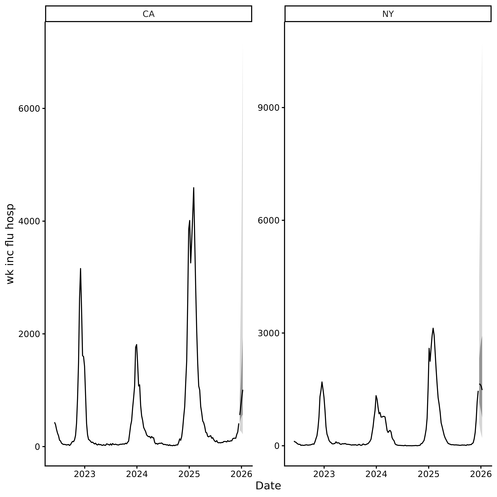

# incast

## Overview

`incast` builds infectious disease forecasts in a few steps:

1.  [`get_data()`](https://accidda.github.io/incast/reference/get_data.md)
    or
    [`check_data()`](https://accidda.github.io/incast/reference/check_data.md)
    fetches or validates surveillance data.
2.  [`get_ncast()`](https://accidda.github.io/incast/reference/get_ncast.md)
    optionally corrects recent weeks for reporting delays.
3.  [`get_cv()`](https://accidda.github.io/incast/reference/get_cv.md)
    optionally compares models by time-series cross-validation.
4.  [`get_fcast()`](https://accidda.github.io/incast/reference/get_fcast.md)
    produces a forecast and ensemble.

See [Planning an infectious disease
forecast](https://accidda.github.io/incast/articles/forecast_planning.md)
before starting a new forecasting project.

``` r

library(incast)
```

## Step 1: Get data

Fetch weekly influenza hospital admissions for New York and California
from the [CDC
NHSN](https://data.cdc.gov/Public-Health-Surveillance/Weekly-Hospital-Respiratory-Data-HRD-Metrics-by-Ju/mpgq-jmmr/about_data)
through [`epidatr`](https://cmu-delphi.github.io/epidatr/).

Set `revisions = TRUE` to fetch the history needed for nowcasting.

``` r

# You may need a Delphi API key to run this code.
# See `?epidatr::get_api_key()` for details.
df <- get_data(pathogen = "flu", geo_value = c("ny", "ca"), revisions = TRUE)
```

Pass other data through
[`check_data()`](https://accidda.github.io/incast/reference/check_data.md).
See
[`vignette("external_data")`](https://accidda.github.io/incast/articles/external_data.md)
for the required format.

``` r

tail(example_data)
#> # A tibble: 6 × 5
#>   as_of      location target          target_end_date observation
#>   <date>     <chr>    <chr>           <date>                <dbl>
#> 1 2025-12-07 CA       wk inc flu hosp 2025-12-06              233
#> 2 2025-12-14 CA       wk inc flu hosp 2025-12-06              259
#> 3 2025-12-07 NY       wk inc flu hosp 2025-12-06             1160
#> 4 2025-12-14 NY       wk inc flu hosp 2025-12-06             1171
#> 5 2025-12-14 CA       wk inc flu hosp 2025-12-13              412
#> 6 2025-12-14 NY       wk inc flu hosp 2025-12-13             1462
df <- check_data(example_data)
autoplot(df)
```


## Step 2: Nowcast (optional)

Recent surveillance counts may be incomplete because reports arrive
late. Using them directly can bias forecasts downwards.

[`get_ncast()`](https://accidda.github.io/incast/reference/get_ncast.md)
estimates their final values. By default it corrects the last two weeks
and leaves earlier observations unchanged.

``` r

ncast <- get_ncast(df)
ncast
#> <incast_ncast>
#> Target:   wk inc flu hosp
#> Series:   2 (location)
#> Window:   2022-06-04 to 2025-12-13 (7-day interval)
#> Nowcast:  2025-12-06 to 2025-12-13
autoplot(ncast)
```


For corrected weeks, `ncast$data` contains `ncast_lower` and
`ncast_upper` 95% credible interval bounds.
[`get_fcast()`](https://accidda.github.io/incast/reference/get_fcast.md)
carries this uncertainty into the forecast.

## Step 3: Forecasting

The forecast workflow has two steps:

1.  [`get_cv()`](https://accidda.github.io/incast/reference/get_cv.md)
    evaluates models and ranks them by weighted interval score (WIS).
2.  [`get_fcast()`](https://accidda.github.io/incast/reference/get_fcast.md)
    fits the models to all available data, combines the best `top_n` and
    forecasts `h` reporting intervals ahead.

The default models are:

| Model   | Description                        |
|---------|------------------------------------|
| `NAIVE` | Carries the latest value forwards  |
| `ETS`   | Exponential smoothing              |
| `THETA` | Theta method                       |
| `ARIMA` | Automatically selected ARIMA model |

### Cross-validation

[`get_cv()`](https://accidda.github.io/incast/reference/get_cv.md)
performs rolling-origin [time series
cross-validation](https://otexts.com/fpp3/tscv.html).

Three arguments set the evaluation period:

- `h`: forecast horizon in reporting intervals.

- `step`: spacing between forecast origins.

  - `step = h` (default) produces non-overlapping forecasts and is the
    fastest option.
  - `step < h` produces more, overlapping forecasts.

- Supply one origin argument:

  - `n_origins`: the number of forecast origins.
  - `eval_start_date`: the date of the first forecast origin.
  - `origins`: explicit dates, including non-contiguous dates.

A forecast origin at time `d` predicts intervals `d` to `d + h - 1`, so
`n_origins` origins spaced `step` intervals apart cover the last
`h + (n_origins - 1) * step` reporting intervals of the series. For
example, with `h = 4`, `step = 4`, and `n_origins = 3`, the evaluation
period covers the last 12 intervals:

``` text
Forecast 1: [d,   d+1, d+2,  d+3]
Forecast 2: [d+4, d+5, d+6,  d+7]
Forecast 3: [d+8, d+9, d+10, d+11]
```

More origins give a broader comparison but leave less data before the
first model fit.

The result contains forecasts and scores for each model and series.

``` r

cv <- get_cv(ncast, h = 4, n_origins = 16)
```

``` r

cv
#> <incast_cv>
#> Target:   wk inc flu hosp
#> Series:   2 (location)
#> Window:   2022-06-04 to 2025-12-13 (7-day interval)
#> CV:       4 models x 16 origins (h = 4)
```

Plot relative WIS by model and series. Values below 1 are better than
average.

``` r

autoplot(cv)
```


### Forecast

[`get_fcast()`](https://accidda.github.io/incast/reference/get_fcast.md)
combines the best `top_n` models. Its horizon defaults to the value used
by [`get_cv()`](https://accidda.github.io/incast/reference/get_cv.md).

``` r

fcast <- get_fcast(cv, top_n = 2)
```

``` r

fcast
#> <incast_fcast>
#> Target:   wk inc flu hosp
#> Series:   2 (location)
#> Forecast: 2025-12-20 to 2026-01-10 (h = 4)
#> Models:   4 + ENSEMBLE
```

Plot the ensemble, or set `model` to inspect one model:

``` r

autoplot(fcast)
```



### Adding custom models

Pass any [`fable`](https://fable.tidyverts.org/) model through `models`.
[`incast.odin`](https://github.com/ACCIDDA/incast.odin) adds
transmission models built with `odin2`. Combine custom specifications
with
[`default_models()`](https://accidda.github.io/incast/reference/default_models.md)
to retain the defaults:

``` r

library(fable)
library(fable.prophet)
library(EpiEstim)
library(projections)
library(incast.odin)

# Illustrative inputs for the joint HHH4 models. Replace the connections with
# ones appropriate to your application; rows are sources and columns recipients.
adjacency <- rbind(
  CA = c(CA = 0, NY = 1),
  NY = c(CA = 1, NY = 0)
)
population <- c(CA = 39.4e6, NY = 20.0e6)
population <- population / sum(population)
annual_seasonality <- surveillance::addSeason2formula(
  f = ~1,
  S = 1,
  period = round(365.25 / ncast$interval)
)

my_models <- c(
  default_models(),
  list(
    # Statistical models
    CUSTOM_ARIMA = ARIMA(observation ~ pdq(1, 1, 0)),

    # Epidemiological models
    EPIESTIM = EPIESTIM(
      observation,
      mean_si = 3.5,
      std_si = 2.1,
      rt_window = ncast$interval
    ),
    ODIN2_SIR = odin_sir(observation),
    ODIN2_SEIR = odin_seir(observation),
    HHH4_AR_END = HHH4(
      observation,
      control = list(
        ar = list(f = ~1, lag = 1),
        ne = list(f = ~ -1),
        end = list(f = annual_seasonality),
        family = "NegBin1"
      ),
      population = population
    ),
    HHH4_FULL = HHH4(
      observation,
      control = list(
        ar = list(f = ~1, lag = 1),
        ne = list(f = ~1, lag = 1, normalize = TRUE),
        end = list(f = annual_seasonality),
        family = "NegBin1"
      ),
      neighbourhood = adjacency,
      population = population
    ),

    # Machine learning models
    PROPHET = prophet(observation ~ season("year")),
    NNETAR = NNETAR(observation),

    # Foundation models
    CHRONOS = FOUNDATION(log(observation), "chronos"),
    TIMESFM = FOUNDATION(log(observation), "timesfm")
  )
)

cv <- get_cv(
  ncast,
  n_origins = 16,
  models = my_models
)

fcast <- get_fcast(cv, top_n = 3)
```

## Export to RespiLens

Save the Hubverse output as a CSV, then upload it to
[myRespiLens](https://www.respilens.com/myrespilens):

``` r

write.csv(fcast$hub$model_out_tbl, "respilens.csv", row.names = FALSE)
```
